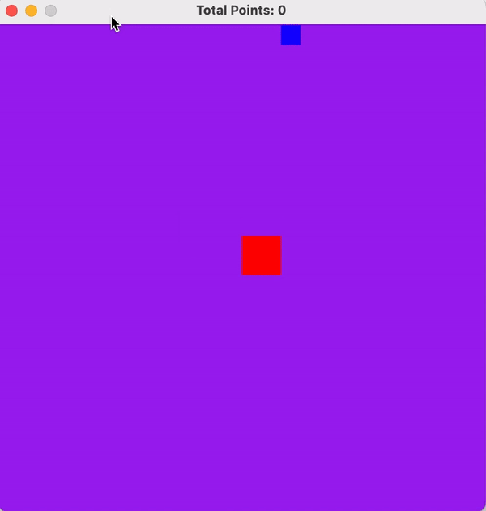
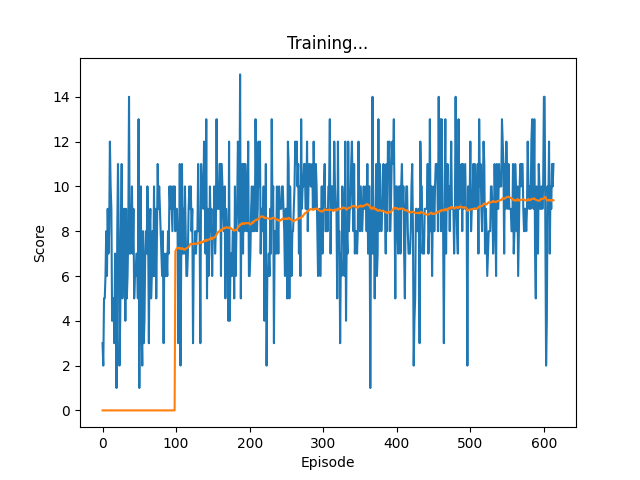

<div align="center">



<h3>AI Video Game Player</h3>

Training a block to eat other blocks via reinforcement learning by [austin fullwood](www.austinfullwood.com).

</div>

## Overview
The environment is a simple game that consist of a player block that tries to "eat" as many food blocks as possible in 10 seconds.

The model uses a DQN (deep q-learning network) to train itself in with a dense reward system. The model is rewarded every frame by the distance it moved towards the food block. If it moves away, the reward becomes negative.

**Rules Of The Games:**
* The blocks are spawned at random.
* The player starts in the middle of the map.
* Map is 500 x 500.
* Block is 40 x 40 square.
* Food is 20 x 20 square.

The score is posted at the top.

## Getting Started
This project requires [Python 3.11.x](https://www.python.org/downloads/) with pip.

Install required packages:
```
pip install -r requirements.txt
```

## Train the model
To train the model, run:
```
python ./src/main.py
```

This will open up a single window with the game. A second window will after the first epoch with a graph of the model's performance for each epoch.

After training is complete, a checkpoint will be saved to a models directory.

## Play the game yourself
To play the game yourself, run:
```
python ./src/game.py
```
The controls are `WSAD` for moving and `R` for restarting.

## Model

***Algorithm:*** A DQN model

***Stage:*** An array containing the blocks current coordinates and the foods current coordinates
```
[player.x, player.y, food.x, food.y]
```

***Action:*** An integer that maps to a direction of motion (the index of the below array)
```
["up", "down", "left", "right"]
```

***Reward:*** The change in distance between the player and food block (DENSE)

***Outcome***: After training the model for about 550 epochs, the model started to level out at around 9.4 blocks in 10 seconds.

## Future Development
1. Force model to identify food and player blocks.
    * Use pixel data and transform it to reduce input size (grayscale, skip frames, etc.).
    * Use CNN to identify block coordinates.
2. Investigate why model performs worst on first iteration of an epoch.
3. Test using sparse reward system.
    * Sparse might only be capable after extensive dense reward training.
4. Restructure model class (move saving, optimization, action selection to it).

## Gallery

<div align="center">
<h4>Training over 600 epochs</h4>



</div>
